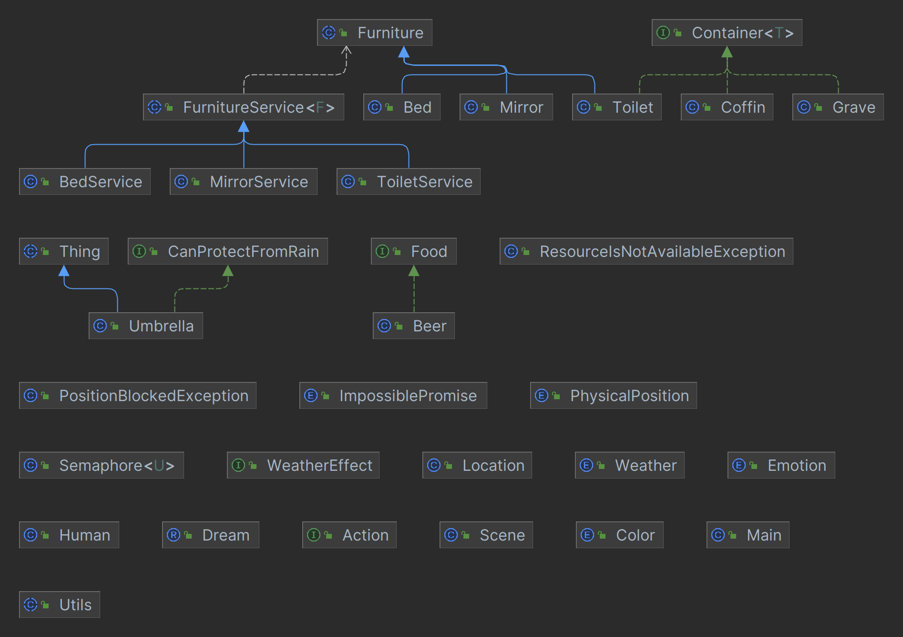

## Текст задания:
Луис проснулся холодным дождливым утром около семи, сжимая в
руках подушку. В голове тяжело отдавались удары сердца, боль накатывала и отступала с тупым постоянством. Во рту был вкус прокисшего пива, а в желудке — страшная тяжесть. Он во сне плакал, подушка была мокрой, словно все невероятные события, которые он пережил во сне, исторгали у него слезы гордости. Но но подумал, что даже в этом сне часть его души знала правду и плакала над ней.
Он встал и поплелся в ванну, сердце подкатило куда-то к горлу, сознание вновь вернулось к прошлому. Это было невыносимо. Он приник к унитазу и вылил в него избыток вчерашнего пива.
Он стоял на полу на коленях с закрытыми глазами, пока не почувствовал в себе силы подняться. Нащупав ручку, смыл следы рвоты. Взглянув в зеркало, он хотел выяснить, что с его глазами — они туманились, но зеркало было завешено куском материи. Потом он вспомнил. Никогда не склонная особо следовать обычаям, Рэчел в этот раз закрыла в доме все зеркала и снимала туфли перед тем, как пройти в дверь.
Не будет никакой олимпийской медали, тупо подумал Луис, вернувшись в комнату и опять плюхнувшись на кровать. Горький вкус пива еще держался во рту, и он поклялся (не в первый, впрочем, раз), что никогда больше не возьмет в рот эту отраву. Никакой олимпийской медали, никакого колледжа, никакого обращения в католичество, никакого лагеря Агаван, ничего. Сандалики его разлетелись, джемпер вывернулся наизнанку; тельце его, такое нежное и хрупкое, почти разорвало на части. Кепка его была вся в крови.
Теперь, сидя на кровати и думая обо всем этом под звуки дождя, лениво капавшего за окном, он еще сильнее ощутил свое горе. Оно пришло и лишило его мужества, лишило воли к жизни, забрало все его силы, бросило в кровать, заставляя думать о том, чтобы любым путем вернуть прошлое. Любым путем.

## Диграмма

